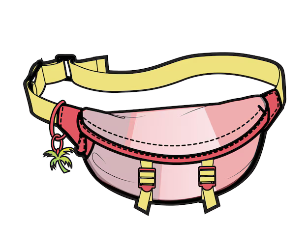

# pochete-cli

[](https://github.com/ivanzigoni/pochete-cli/releases)
[](LICENSE)
[](https://github.com/ivanzigoni/pochete-cli/actions/workflows/tag.yml)
[](https://github.com/ivanzigoni/pochete-cli/releases)

---

O pochete-cli é a ferramenta de linha de comando que inicializa um workspace da
[pochete-toolkit](https://github.com/ivanzigoni/pochete-toolkit) com os repositórios de aplicação
já clonados dentro dele. Um único comando substitui os passos manuais de clonar o workspace, criar
o diretório `project/` e clonar cada repositório de aplicação ali dentro.

## Instalação

Rode:

```bash
curl -fsSL https://raw.githubusercontent.com/ivanzigoni/pochete-cli/main/install.sh | bash
```

O instalador baixa o script `pochete` para `~/.local/bin` (ou para o diretório definido em
`$POCHETE_INSTALL_DIR`) e o marca como executável. Se esse diretório não estiver no seu `PATH`, o
instalador avisa e mostra a linha para adicionar ao `~/.bashrc`.

## Atualização

Não há gerenciador de pacote nem subcomando de atualização automática. Para atualizar, rode
novamente o comando de instalação acima — ele sobrescreve o binário existente pela versão mais
recente.

## Uso

Dois subcomandos criam um workspace novo — a diferença é só a forma de dar o input, o resultado é
o mesmo:

- `pochete clone`: inline, todo o input vem de flags. Pensado para ser chamado por um agente ou
  script, nunca pergunta nada.
- `pochete init`: menu interativo. Pensado para uso humano, pergunta cada decisão separadamente.

Os dois passos são sempre os mesmos:

1. Clona a [pochete-toolkit](https://github.com/ivanzigoni/pochete-toolkit) no workspace — a
   origem é fixa, não configurável.
2. Clona cada repositório de aplicação informado dentro de `<workspace>/project/`.

O comando falha se o diretório do workspace já existir, para nunca sobrescrever um diretório
existente.

Opcionalmente, os dois subcomandos também aplicam as configurações padrão recomendadas de
allowlist no workspace recém-criado: sobrescrevem
`.claude/hooks/pctk__enforce-git-allowlist/git-allowlist.json` com um conjunto de subcomandos git
seguros para uso sem intervenção humana, e
`.claude/hooks/pctk__enforce-path-allowlist/path-allowlist.json` com a pasta de planos do usuário
do sistema (`~/.claude/plans`).

### `pochete clone`

```bash
pochete clone --workspace <nome> --repo <url> [--repo <url> ...] [--no-defaults]
```

`--workspace` e ao menos um `--repo` são obrigatórios. `--no-defaults` desativa a aplicação dos
defaults de allowlist — sem a flag, eles são aplicados.

```bash
pochete clone --workspace meu-workspace --repo git@github.com:minha-org/meu-servico.git
```

### `pochete init`

```bash
pochete init
```

Sem argumentos: pergunta o nome do workspace, a URL de cada repositório de aplicação (um de cada
vez, com a opção de adicionar mais), e por fim se deve aplicar os defaults de allowlist.

### Resultado

```
meu-workspace/
├── ...                    # arquivos da pochete-toolkit
└── project/
    └── meu-servico/
```

## Licença

Distribuído sob a licença Apache 2.0. Veja [LICENSE](LICENSE).
