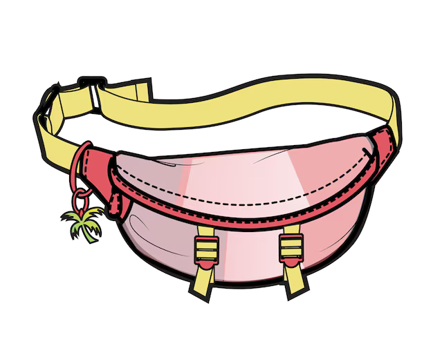

# pochete-cli

[](https://github.com/ivanzigoni/pochete-cli/releases)
[](LICENSE)
[](https://github.com/ivanzigoni/pochete-cli/actions/workflows/tag.yml)
[](https://github.com/ivanzigoni/pochete-cli/releases)

---

O pochete-cli é a ferramenta de linha de comando que inicializa um workspace da
[pochete-toolkit](https://github.com/ivanzigoni/pochete-toolkit) com os repositórios de aplicação
já clonados dentro dele. Um único comando substitui os passos manuais de clonar o workspace, criar
o diretório `project/` e clonar cada repositório de aplicação ali dentro.

## Instalação

Rode:

```bash
curl -fsSL https://raw.githubusercontent.com/ivanzigoni/pochete-cli/main/install.sh | bash
```

O instalador baixa o script `pochete` para `~/.local/bin` (ou para o diretório definido em
`$POCHETE_INSTALL_DIR`) e o marca como executável. Se esse diretório não estiver no seu `PATH`, o
instalador avisa e mostra a linha para adicionar ao `~/.bashrc`. Requer Node.js e npm instalados —
o instalador também usa o npm para instalar, ao lado do binário, a dependência de runtime do
comando `build`.

## Atualização

Não há gerenciador de pacote nem subcomando de atualização automática. Para atualizar, rode
novamente o comando de instalação acima — ele sobrescreve o binário existente pela versão mais
recente.

## Uso

Dois subcomandos criam um workspace novo — a diferença é só a forma de dar o input, o resultado é
o mesmo:

- `pochete clone`: inline, todo o input vem de flags. Pensado para ser chamado por um agente ou
  script, nunca pergunta nada.
- `pochete init`: menu interativo. Pensado para uso humano, pergunta cada decisão separadamente.

Os dois passos são sempre os mesmos:

1. Clona a [pochete-toolkit](https://github.com/ivanzigoni/pochete-toolkit) no workspace — a
   origem é fixa, não configurável.
2. Opcionalmente, clona cada repositório de aplicação informado dentro de
   `<workspace>/project/`. Sem nenhum repositório informado, o workspace nasce com `project/`
   vazio.

O comando falha se o diretório do workspace já existir, para nunca sobrescrever um diretório
existente.

Opcionalmente, os dois subcomandos também aplicam as configurações padrão recomendadas de
allowlist no workspace recém-criado: sobrescrevem
`.claude/hooks/pctk__enforce-git-allowlist/git-allowlist.json` com um conjunto de subcomandos git
seguros para uso sem intervenção humana, e
`.claude/hooks/pctk__enforce-path-allowlist/path-allowlist.json` com a pasta de planos do usuário
do sistema (`~/.claude/plans`).

### `pochete clone`

```bash
pochete clone --workspace <nome> [--repo <url> ...] [--no-defaults]
```

`--workspace` é obrigatório. `--repo` é opcional e repetível — sem nenhum `--repo`, o workspace
nasce com `project/` vazio. `--no-defaults` desativa a aplicação dos defaults de allowlist — sem a
flag, eles são aplicados.

```bash
pochete clone --workspace meu-workspace --repo git@github.com:minha-org/meu-servico.git
```

### `pochete init`

```bash
pochete init
```

Sem argumentos: pergunta o nome do workspace, se deve adicionar um repositório de aplicação (e, se
sim, a URL — um de cada vez, com a opção de adicionar mais), e por fim se deve aplicar os defaults
de allowlist. Respondendo "não" já na primeira pergunta sobre repositório, o workspace nasce sem
nenhum em `project/`.

### `pochete build`

```bash
pochete build
```

Roda a partir da raiz de um workspace já criado. Lê `domain/` e escreve o Markdown final em
`.claude/` — sempre sobrescrevendo incondicionalmente, já que esse conteúdo é gerado e nunca
editado à mão. Falha se `domain/` não existir no diretório atual.

`domain/` não tem estrutura de pastas obrigatória — organize o conteúdo em quantos
subdiretórios quiser. Qualquer arquivo `.tsx` em qualquer profundidade vira componente
customizado disponível para os `.mdx`. `Skill`, `Rule` e `Block` são as três unidades de
construção disponíveis: cada `.mdx` precisa estar embrulhado em uma delas para gerar saída.

- `<Skill name="..." description="...">` → `.claude/skills/user__<nome-do-arquivo>/SKILL.md`
- `<Rule paths={[...]}>` → `.claude/rules/user__<nome-do-arquivo>.md`
- `<Block>` → `.claude/blocks/user__<nome-do-arquivo>.md`

Um `.mdx` que não usa nenhuma das três é ignorado pelo build (aviso no terminal, sem falhar) —
é o caso, por exemplo, de um fragmento que só existe para ser incluído por outro arquivo via
`<Include>`.

### Resultado

```
meu-workspace/
├── ...                    # arquivos da pochete-toolkit
└── project/
    └── meu-servico/       # um subdiretório por repositório informado, ou nenhum
```

## Licença

Distribuído sob a licença Apache 2.0. Veja [LICENSE](LICENSE).
